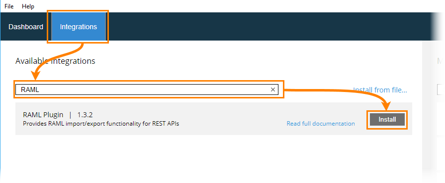
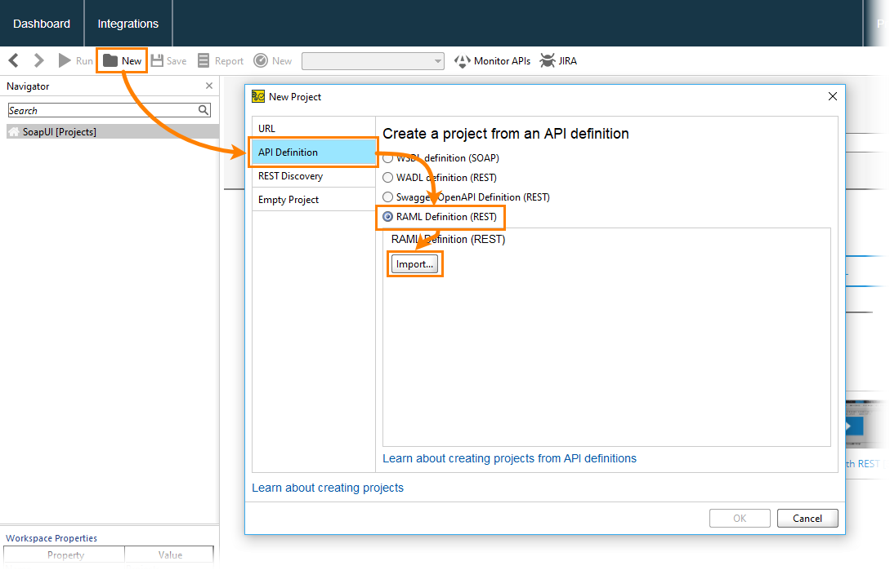

# SoapUI RAML Plugin

This repository contains source code for the RAML plugin for ReadyAPI. Use this plugin to:

- Import RAML files to SoapUI to test your REST APIs
- Generate a REST Mock Service for the RAML file being imported
- Update an existing REST Service in SoapUI from a RAML file
- Generate a RAML file for any REST API defined in SoapUI

For detailed information, please visit the following page:<br/>[http://olensmar.blogspot.se/2013/12/a-raml-apihub-plugin-for-soapui.html](http://olensmar.blogspot.se/2013/12/a-raml-apihub-plugin-for-soapui.html).

## Plugin info

* Author: SmartBear Software ([http://smartbear.com](http://smartbear.com))
* Plugin version: 1.3.4
* Supported RAML specification: ver 1.0 or earlier. See [RAML 1.0 specification](https://github.com/raml-org/raml-spec/blob/master/versions/raml-10/raml-10.md/).

## Requirements

The plugin requires ReadyAPI version 2.6 or later.

## Working with the plugin

### Install the plugin



To install the plugin:

1. In ReadyAPI, switch to the Integrations tab.
2. Find ReadyAPI Postman Plugin and click Install.
3. Confirm that you want to download and install the plugin.
### Build it yourself

Clone the Git repository, make sure you have Maven installed and execute the following command:

```
mvn clean install assembly:single
```

### Create a project



To create a project by using a RAML definition:

1. Select **File > New Project**.
2. In the **New Project** dialog, select **API Definition > RAML Definition**. Click **Import**.
3. In the **Create RAML Project** dialog, specify your RAML definition.
4. Click **OK**.
5. Save the new project using the subsequent dialog.

## Specifics

The SoapUI RAML plugin ignores the following constructs:

* security declarations
* protocols
* schemas
